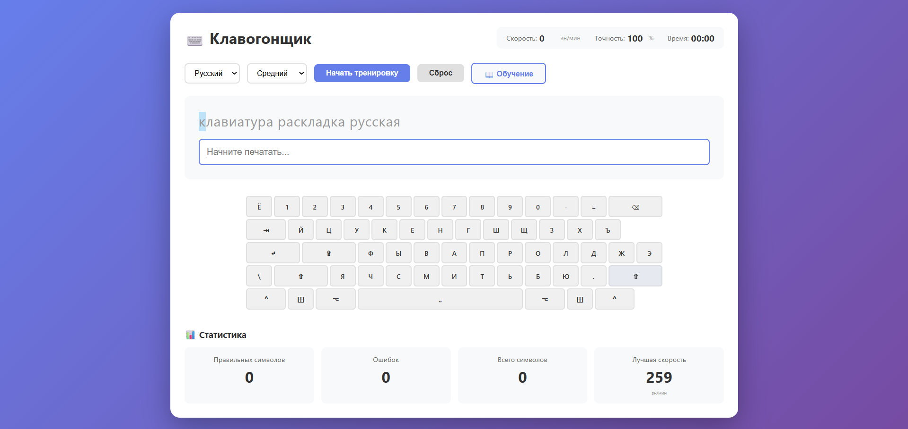
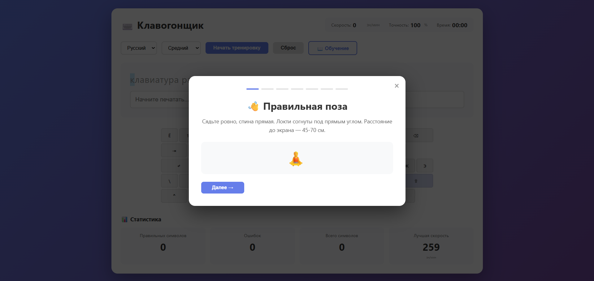
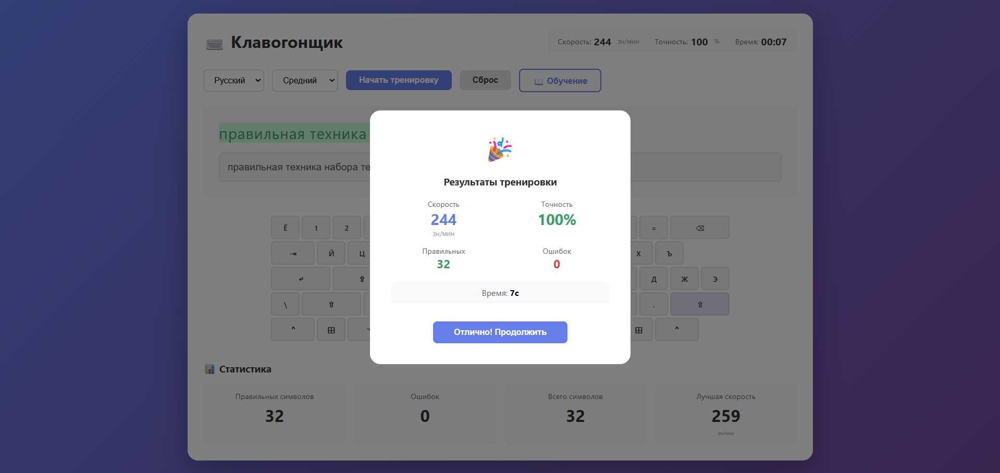

# ⌨️ Клавогонщик - Тренажер слепой печати

Интерактивное веб-приложение для обучения и тренировки навыков слепой печати на клавиатуре. Подходит как для новичков, так и для опытных пользователей, желающих улучшить скорость и точность печати.

## ✨ Особенности

- 🎯 **Обучение с нуля** - интерактивный туториал с визуальным отображением правильной постановки пальцев
- ⌨️ **Визуальная клавиатура** - подсветка нажимаемых клавиш и обратная связь (правильно/неправильно)
- 📊 **Детальная статистика** - скорость печати (зн/мин), точность, количество ошибок
- 🌍 **Два языка** - русский и английский
- 📈 **Три уровня сложности** - легкий, средний, сложный
- 💾 **Сохранение прогресса** - лучший результат сохраняется в localStorage
- 📱 **Адаптивный дизайн** - работает на всех устройствах
- 🎮 **Удобное управление** - навигация стрелками во время обучения

## 🖼️ Скриншоты

## 🚀 Демо

[Живая демонстрация](https://quarikai.github.io/Key-Racer/)

## 📦 Установка и запуск
